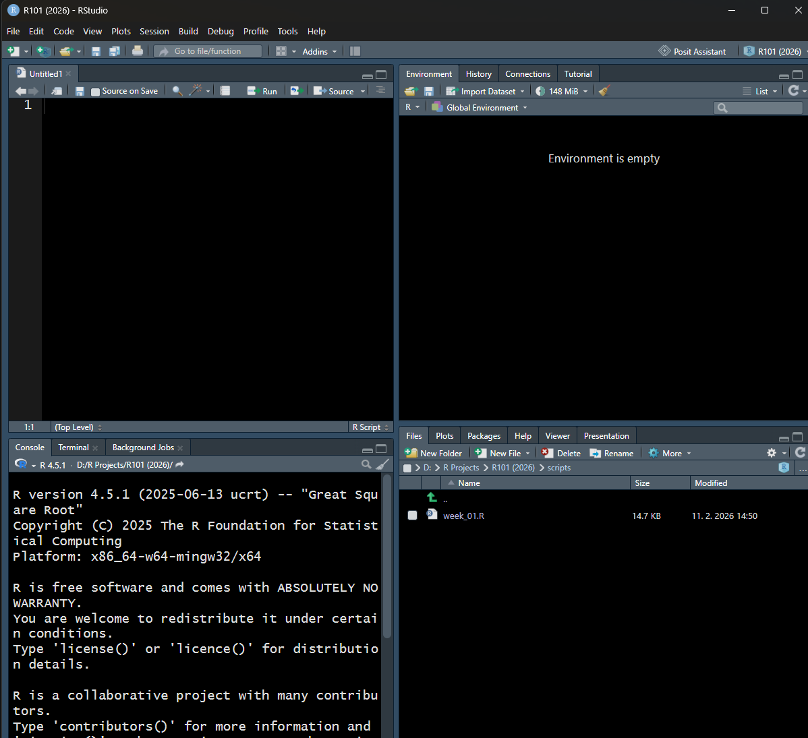
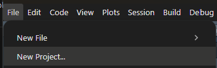
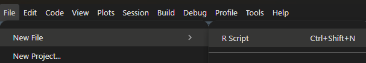
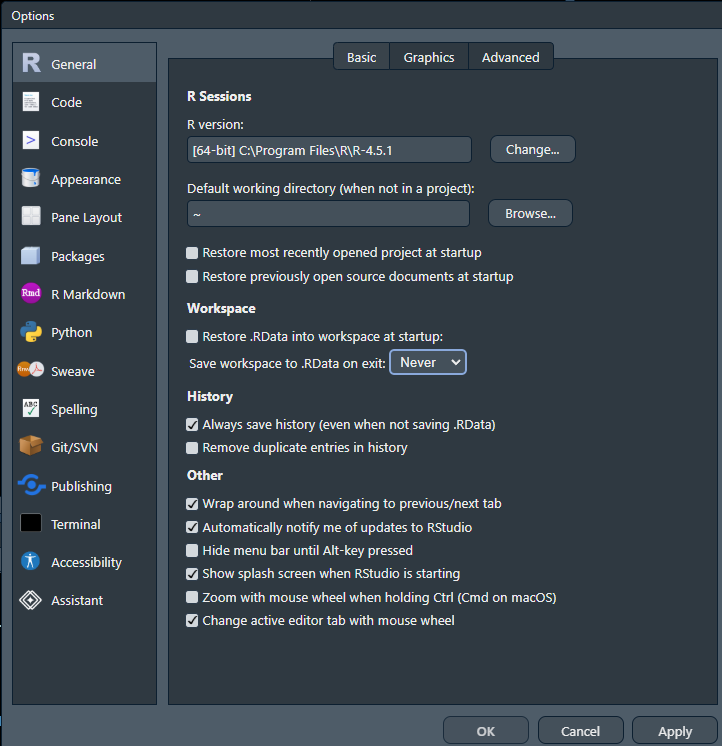
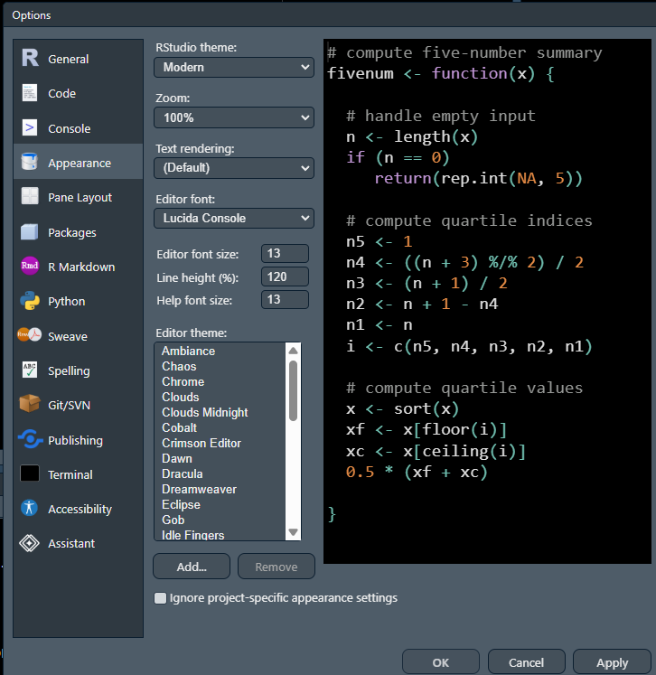
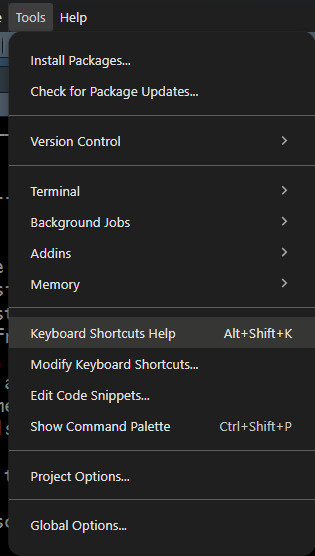
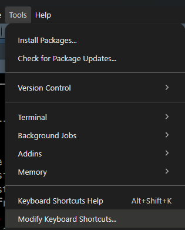
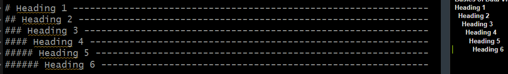

## Co se naučíte

V této lekci si připravíte prostředí pro práci s daty, napíšete první příkazy a spočítáte jednoduché souhrny. Na konci byste měli umět rozlišit R od RStudia, založit projekt, uložit a spustit skript, vytvořit objekt a použít funkci. Vyzkoušíte si také, zda se váš výsledek podaří znovu získat po restartu R.

Předpokládáme nainstalované **R a RStudio Desktop** a základní orientaci v souborech a složkách. Programovat zatím umět nemusíte. Instalaci a připojení balíčků si vyzkoušíte na tidyverse; žádný vlastní datový soubor nepotřebujete.

Příklady s reakčními časy a dotazníkovými skóry jsou **uměle vytvořené pro výuku**, nejde o výsledky psychologického výzkumu.

## R počítá, RStudio pomáhá s prací

**R** je programovací jazyk a prostředí pro statistické výpočty a grafiku. **RStudio** je integrované vývojové prostředí (IDE): poskytuje editor, konzoli, prohlížení dat, grafů a nápovědy. Výpočet provádí R; RStudio usnadňuje jeho zadání a organizaci. R lze používat i bez RStudia. R je svobodný software s otevřeným zdrojovým kódem a další funkce do něj přidáváme prostřednictvím balíčků. [Zdroj: R Project – What is R?](https://www.r-project.org/about.html)

Pro psychologický výzkum je důležitá možnost uchovat **postup analýzy jako kód**. I když se změní vstupní data, můžeme znovu provést stejné kroky a obnovit tabulky i grafy. Kód také umožňuje kolegovi zkontrolovat, jak jsme vytvořili skóry nebo vybrali případy. Sám o sobě ale nezaručuje správnou analýzu: musíme uchovat potřebná data, znát význam proměnných a zdůvodnit analytická rozhodnutí.

Reprodukovatelný postup lze zachytit i v jiných statistických programech, například uložením skriptu (syntaxu) nebo záznamu analýzy. Rozhodující je úplnost záznamu a možnost analýzu zopakovat.

### Čtyři hlavní oblasti RStudia

Snímky ukazují RStudio ve Windows. Pokud používáte jiný systém nebo verzi, vzhled a umístění některých voleb se mohou mírně lišit.

{#fig-rstudio fig-alt="Čtyři oblasti RStudia: editor vlevo nahoře, konzole vlevo dole, Environment vpravo nahoře a soubory, grafy i nápověda vpravo dole." width="850"}

Na snímku @fig-rstudio je už otevřený prázdný skript `Untitled1`. Bez otevřeného skriptu nemusí být levý horní panel vidět. Rozložení lze upravit v **Tools → Global Options → Pane Layout**. Důležitější než poloha je proto název karty. [Zdroj: Posit – Pane Layout](https://docs.posit.co/ide/user/ide/guide/ui/ui-panes.html)

| Oblast na snímku | K čemu slouží |
|:-----------------------------------|:-----------------------------------|
| **Editor / Source**, vlevo nahoře | Píšeme, upravujeme a ukládáme skripty. Napsaný kód se provede až po spuštění. |
| **Console**, vlevo dole | R zde provádí příkazy a vypisuje výsledky, chyby a varování. Konzole R není totéž co sousední Terminal. |
| **Environment**, vpravo nahoře | Přehled uživatelských objektů v aktuální relaci, například dat a uložených výsledků. |
| **Files / Plots / Packages / Help**, vpravo dole | Procházení souborů, zobrazení grafů, práce s balíčky a dokumentace. Přepínáme mezi kartami. |

**Relace (session)** je jeden běh R. Objekty v paměti patří této relaci; soubory uložené na disku setrvávají i po jejím ukončení. Environment proto není složka s datovými soubory. Ani to, že vidíte soubor v kartě Files, neznamená, že jeho obsah už R načetlo.

### Cvičení 1: Kam se podíváte? {.exercise}

Najděte v RStudiu místo, kde budete psát skript, místo pro výsledek výpočtu a kartu pro grafy. Potom vysvětlete: znamená hláška „Environment is empty“, že složka projektu neobsahuje žádné soubory?

::: {.callout-note collapse="true" title="Ukázat řešení"}
Skript píšeme v editoru, číselný výsledek se obvykle vypíše do konzole a graf se při interaktivní práci zobrazí na kartě **Plots**. Pokud editor chybí, otevřeme nový R skript podle postupu níže. „Environment is empty“ znamená, že v globálním prostředí nejsou uživatelské objekty. Na disku přesto mohou být skripty, data i dříve uložené grafy; ty prohlížíme v **Files**.
:::

## Nejdříve založte projekt {#sec-projekt}

Pro samostatný výzkum či ucelenou sadu analýz používejte jeden **RStudio projekt**. Pro tento kurz si můžete založit projekt `r101` a ukládat do něj všechny lekce. Není nutné zakládat nový projekt pro každý skript.

Projekt propojuje práci s určitou složkou. Když jej otevřete, RStudio v běžné relaci nastaví tuto složku jako **pracovní adresář**: výchozí místo, vůči němuž R hledá a ukládá soubory. Projekt také uchovává vlastní nastavení a stav editoru a umožňuje zapojit nástroje jako Git. Soubor `.Rproj` obsahuje nastavení, nikoli celou analýzu; data a skripty zůstávají samostatnými soubory. [Zdroj: Posit – RStudio Projects](https://docs.posit.co/ide/user/ide/guide/code/projects.html)

### Vytvoření a otevření projektu

{#fig-new-project fig-alt="Nabídka File v RStudiu se zvýrazněnou položkou New Project." width="355"}

1.  Zvolte **File → New Project…** (@fig-new-project).
2.  Pro novou složku vyberte **New Directory** a pak **New Project**; v některých verzích se tato volba jmenuje **Empty Project**.
3.  Do **Directory name** napište `r101`. Pomocí **Browse…** zvolte nadřazenou složku, například svou složku pro studium. RStudio uvnitř vytvoří novou složku `r101`.
4.  Klikněte na **Create Project**. Vpravo nahoře zkontrolujte jeho název a v kartě Files soubor `r101.Rproj`.

Pokud už máte složku se skripty a daty, použijte **Existing Directory**. Příště projekt otevřete dvojklikem na `.Rproj` nebo přes **File → Open Project…**. Pro přenesení práce potřebujete celou příslušnou složku, nikoli samotný soubor `.Rproj`.

### Složky, ve kterých se vyznáte

Na kartě **Files** přejděte do kořene projektu a použijte **New Folder**. Nejprve založte `scripts`, `data` a `output`; uvnitř `data` pak `raw` a `clean`, uvnitř `output` složky `figures` a `tables`. Vhodná počáteční struktura je následující:

| Cesta v projektu | Obsah a pravidlo |
|:-----------------------------------|:-----------------------------------|
| `r101.Rproj` | Nastavení a vstupní bod projektu. |
| `scripts/` | Skripty, např. `01_uvod.R` nebo později `02_cisteni.R`. |
| `data/raw/` | Původní vstupní data. Neupravujeme je přepisováním; změny popisujeme ve skriptu. |
| `data/clean/` | Vyčištěná data vytvořená skriptem ze vstupů. |
| `output/figures/` | Grafy, které lze znovu vytvořit kódem. |
| `output/tables/` | Exportované tabulky výsledků. |

Toto je organizační doporučení, nikoli povinná struktura R. Na začátku postačí složky, které opravdu využijete. Názvy bez mezer a diakritiky zjednodušují přenositelnost a psaní cest; R však řadu názvů s mezerami i diakritikou podporuje. Skrytá složka `.Rproj.user` je technické zázemí RStudia, ne místo pro vlastní data.

**Relativní cesta** `data/raw/dotaznik.csv` říká „ze současného pracovního adresáře otevři složku data, v ní raw a pak soubor dotaznik.csv“. Při zachování struktury projektu může fungovat i na jiném počítači. Do společného skriptu proto běžně nepíšeme cestu ke konkrétnímu disku ani `setwd()` s vlastní složkou. V cestách v R je praktické používat `/`, a to i ve Windows.

Pracovní adresář zjistíte funkcí `getwd()`; závorky znamenají zavolání funkce. Spusťte následující příkaz v konzoli a zkontrolujte, že vypsaná cesta vede do složky vašeho projektu:

```{r}
#| label: pracovni-adresar
#| eval: false
getwd()
```

Pouhé procházení složek na kartě Files pracovní adresář R nemění. Příklady v této lekci spouštějte v otevřeném projektu `r101`; relativní cesty pak budou vycházet z jeho hlavní složky.

Projekt sám nezálohuje data, neuchovává automaticky všechny verze balíčků a nezaručuje stejný výsledek na každém počítači. Prozatím potřebujeme především úplný skript, dostupné vstupy a přehledné cesty. Správu verzí a závislostí budeme řešit později.

### Cvičení 2: Připravte si místo pro práci {.exercise}

Založte projekt `r101` nebo otevřete už vytvořený kurzový projekt. Vytvořte `scripts`, `data/raw`, `data/clean` a `output/figures`. Kam byste uložili původní export dotazníku a kam jeho vyčištěnou verzi? Stačí kolegovi poslat `.Rproj`, aby mohl analýzu spustit?

Úloha inspirovaná [R4DS, kapitolou 6.2](https://r4ds.hadley.nz/workflow-scripts.html#projects).

::: {.callout-note collapse="true" title="Ukázat řešení"}
Projekt otevřeme přes `.Rproj` a ověříme jeho název vpravo nahoře. Na kartě Files vytvoříme nejprve hlavní složky a pak jejich podsložky. Původní export patří do `data/raw`, odvozená vyčištěná data do `data/clean`. Postup čištění později uložíme do skriptu ve `scripts`.

Samotný `.Rproj` nestačí: kolega potřebuje také skripty a jejich datové vstupy, případně další soubory, na které skripty odkazují. Musí mít samozřejmě také nainstalováno R a relevantní balíčky. Organizace složek usnadňuje přenos, ale nenahrazuje úplný záznam postupu.
:::

## Skript, čistá relace a pohodlné ovládání {#sec-skript}

### Nový skript a první spuštění

**Skript** je textový soubor s příkazy, zpravidla s příponou `.R`. Otevřete **File → New File → R Script** nebo ve Windows stiskněte **Ctrl + Shift + N**. Můžete jej hned uložit přes **File → Save As…** do `scripts/01_uvod.R`.

{#fig-new-script fig-alt="Nabídka File → New File → R Script." width="607"}

Do editoru napište:

```{r}
#| label: prvni-prikaz
5 + 5
```

Kurzor ponechte na řádku a stiskněte **Ctrl + Enter**. RStudio odešle příkaz do konzole a R vypíše `10`. Je-li označena část textu, spouští se označený výběr; bez výběru editor rozpoznává aktuální řádek a spustí příkaz právě na aktuálním řádku (u víceřádkového příkazu se spustí celý blok). Uložit skript a spustit jej jsou dvě různé akce: **Ctrl + S ukládá text, Ctrl + Enter spouští kód**.

Při čtení výstupu můžete vidět `[1] 10`. Značka `[1]` je index prvního vypsaného prvku na řádku, nikoli další výsledek. Výzva `>` v konzoli znamená, že R čeká na další příkaz. Do skriptu se nekopírují ani výzvy, ani výstup; tlačítka **Zkopírovat** v této lekci kopírují pouze kód.

Praktické pravidlo zní: **všechny kroky, které vytvářejí, upravují nebo analyzují data, zapisujte do skriptu**. Konzole se hodí pro rychlou kontrolu nebo otevření nápovědy. Jestliže se z pokusu v konzoli stane součást analýzy, přeneste jej do skriptu. Výsledný skript má být srozumitelný postup ve správném pořadí, nemusí uchovávat každý opuštěný pokus.

### Začínejte s čistým pracovním prostředím

Objekty uložené v paměti může RStudio při ukončení uložit do `.RData` a při startu obnovit. Pak může fungovat i neúplný skript, protože spoléhá na objekt vytvořený v některé z předchozích relací (session). Tento problém odstraníme tím, že budeme prostředí obnovovat **spuštěním skriptu ze vstupních dat**.

V **Tools → Global Options → General** nastavte:

1.  **Restore .RData into workspace at startup**: zrušit zaškrtnutí.
2.  **Save workspace to .RData on exit**: vybrat **Never**.
3.  Potvrdit **Apply** nebo **OK**.

{#fig-workspace fig-alt="General v Global Options: nezaškrtnuté Restore .RData into workspace at startup a Save workspace to .RData on exit nastavené na Never." width="650"}

Zkontrolujte také **Tools → Project Options → General**: nastavení projektu může globální volbu přepsat. Pro obnovení prostředí zvolte **No** a pro ukládání **No / Never** podle znění dané verze, případně **Default**, pokud už globální nastavení odpovídá doporučení. [Zdroj: Posit – Project options](https://docs.posit.co/ide/user/ide/guide/code/projects.html#project-options)

Na snímku jsou vypnuté i volby pro otevření posledního projektu a dokumentů. **Ty vypínat nemusíte, ale můžete** (podle toho, co vám osobně vyhovuje): obnovení karet editoru je něco jiného než obnovení datových objektů. Historie příkazů `.Rhistory` může zůstat zapnutá, ale nenahrazuje uspořádaný skript. Ukládání `.R` souborů přes Ctrl + S používáme dál. [Srov. doporučení v R4DS, 6.2.1](https://r4ds.hadley.nz/workflow-scripts.html#what-is-the-source-of-truth)

Před kontrolou uložte skript a zvolte **Session → Restart R**. Potom jej spusťte od začátku: označte celý jeho obsah a stiskněte Ctrl + Enter. Smazání textu konzole není restart; ani odstranění objektů koštětem v Environment neobnoví například stav načtených balíčků. Restart ukončí dosavadní výpočty a odstraní neuložené objekty z paměti, proto nejprve zachyťte veškterý potřebný postup ve skriptu.

### Nastavte si vzhled

Otevřete **Tools → Global Options → Appearance**. V položce **Editor theme** vyberte motiv a v náhledu posuďte čitelnost kódu i komentářů. Upravte také **Editor font size**, případně celkové **Zoom**, a potvrďte Apply nebo OK.

{#fig-appearance fig-alt="Appearance v RStudiu: vlevo velikost písma a seznam motivů, vpravo náhled syntaxe na tmavém pozadí." width="650"}

Vyberte si světlý či tmavý motiv podle vlastního pohodlí a osvětlení. Z tmavých motivů můžete vyzkoušet například **Tomorrow Night Bright**, který je v seznamu na snímku. Dbejte na dobře čitelné písmo a dostatečný kontrast. Vzhled editoru nemění výsledky výpočtů ani automaticky neurčuje vzhled vytvořeného grafu. [Zdroj k nastavení: Posit – Themes](https://docs.posit.co/ide/user/ide/guide/ui/appearance.html)

### Nápověda ke zkratkám a jejich úprava

Přehled otevřete přes **Tools → Keyboard Shortcuts Help**, ve Windows také **Alt + Shift + K**. Nemusíte si pamatovat celý seznam: nejprve si osvojte vytvoření skriptu, uložení a spuštění příkazu.

{#fig-shortcut-help fig-alt="Tools → Keyboard Shortcuts Help, se zkratkou Alt+Shift+K." width="315"}

| Akce                      | Windows / Linux    | macOS              |
|:--------------------------|:-------------------|:-------------------|
| Nový R skript             | Ctrl + Shift + N   | Cmd + Shift + N    |
| Uložit dokument           | Ctrl + S           | Cmd + S            |
| Spustit příkaz nebo výběr | Ctrl + Enter       | Cmd + Return       |
| Vložit přiřazení `<-`     | Alt + −            | Option + −         |
| Vložit nadpis sekce       | Ctrl + Shift + R   | Cmd + Shift + R    |
| Přehled zkratek           | Alt + Shift + K    | Option + Shift + K |
| Restartovat R             | Ctrl + Shift + F10 | Cmd + Shift + 0    |

Jde o výchozí zkratky. Přepnutím českého a anglického rozložení nepřenastavujete příkazy RStudia: například Ctrl + Enter nadále slouží ke spuštění kódu a Ctrl + S k uložení. Nelze ale zaručit stejné chování každé kombinace na všech rozloženích, zejména u kláves se symboly; roli hraje také operační systém a vlastní úpravy. Aktuální přehled ve vašem RStudiu je rozhodující. [Zdroj: Posit – Keyboard Shortcuts](https://docs.posit.co/ide/user/ide/reference/shortcuts.html)

Pro změnu otevřete **Tools → Modify Keyboard Shortcuts…**. V poli **Filter** vyhledejte příkaz, klikněte do buňky s jeho zkratkou a stiskněte novou kombinaci. Zkontrolujte případné zvýraznění konfliktu s jiným příkazem a potvrďte **Apply**. Pro první lekce doporučujeme výchozí zkratky zachovat, pokud vám fungují; snadněji pak sledujete výklad. [Zdroj: Posit – Custom Shortcuts](https://docs.posit.co/ide/user/ide/guide/productivity/custom-shortcuts.html)

{#fig-shortcut-modify fig-alt="Nabídka Tools se zvýrazněnou položkou Modify Keyboard Shortcuts." width="315"}

### Jak psát speciální znaky na klávesnici {#specialni-znaky}

V R používáme znaky, které při psaní běžného českého textu potřebujeme méně často. Můžete zůstat u **české klávesnice** a zadávat je pomocí pravého Alt, označovaného také **AltGr**, nebo přepnout na **anglické rozložení US**, kde je řada těchto znaků dostupná přímo či pomocí klávesy Shift. České rozložení usnadňuje psaní diakritiky v komentářích; v anglickém US není česká diakritika přímo dostupná. Záleží tedy na tom, co vám vyhovuje. Rozložení také můžete při práci střídat. Ve Windows lze mezi nainstalovanými rozloženími přepínat pomocí Windows + mezerník.

Následující tabulka platí pro **standardní české rozložení QWERTZ ve Windows a anglické US**. Jiné varianty, například české programátorské nebo anglické britské rozložení, se mohou lišit. Písmena F, G apod. označují klávesy; Shift k nim nepřidáváte. V anglickém sloupci se řiďte označením kláves v rozložení US, které nemusí odpovídat českým popiskům na vaší fyzické klávesnici.

::: keyboard-table
| Znak a název | České QWERTZ (Windows) | Anglické US | K čemu slouží v R |
|:-----------------|:-----------------|:-----------------|:-----------------|
| `#` – mřížka (*hastag*) | AltGr + X | Shift + 3 | Začátek komentáře, tedy poznámky, kterou R neprovádí. |
| `[` a `]` – hranaté závorky | AltGr + F a AltGr + G | Samostatné klávesy `[` a `]` | Výběr části dat, například jedné hodnoty nebo řádku tabulky. |
| `{` a `}` – složené závorky | AltGr + B a AltGr + N | Shift + `[` a Shift + `]` | Sdružení příkazů do bloku, například při tvorbě vlastní funkce. |
| `<` – menší než | AltGr + čárka | Shift + čárka | Porovnání hodnot; také součást přiřazení `<-`, kterým ukládáme výsledek pod jménem. |
| `>` – větší než | AltGr + tečka | Shift + tečka | Porovnání hodnot. Na začátku řádku konzole jde o výzvu k zadání příkazu, kterou neopisujeme. |
| `$` – dolar | AltGr + ů | Shift + 4 | Přístup k pojmenované části objektu, například sloupci datové tabulky. |
| `&` – ampersand | AltGr + C | Shift + 7 | Logické „a zároveň“: spojení podmínek, které mají platit současně pro daný prvek. |
| `^` – stříška (*caret*) | AltGr + š, potom mezerník | Shift + 6 | Umocňování, například `2^3` znamená dvě na třetí. |
| `` ` `` – zpětný apostrof (*backtick*) | AltGr + ý, potom mezerník | Klávesa vlevo od 1, bez Shiftu | Ohraničení nestandardního jména, například jména sloupce obsahujícího mezeru. Není to uvozovka pro běžný text. |
:::

**Většinu těchto znaků zatím nebudeme potřebovat.** Tabulka slouží jako přehled, ke kterému se můžete vracet; příslušné postupy vysvětlíme při použití. Teď se soustřeďte na komentář `#`, přiřazení `<-` a stříšku `^` pro mocniny. Významy znaků popisuje [oficiální příručka jazyka R](https://stat.ethz.ch/CRAN/doc/manuals/R-lang.html#Tokens); varianty klávesnic rozlišuje [přehled rozložení Windows od Microsoftu](https://learn.microsoft.com/en-us/globalization/windows-keyboard-layouts).

U stříšky a zpětného apostrofu je v českém rozložení první kombinace **mrtvá klávesa**: čeká na další stisk. Pro samostatný znak pusťte AltGr a stiskněte mezerník. AltGr + F píše pouze levou hranatou závorku a AltGr + B pouze levou složenou závorku; v RStudio ale stačí obvykle napsat levou závorku a pravá se doplní pomocí našeptávání. Kombinace pro psaní znaků patří k rozložení klávesnice, zatímco například Ctrl + Enter je příkaz RStudia.

### Cvičení 3: Soubor, nebo paměť? {.exercise}

Uložte do `scripts/01_uvod.R` příkaz `5 + 5` a spusťte jej z editoru. Vypněte obnovování a ukládání `.RData`, uložte skript, restartujte R a spusťte ho znovu. Potom otevřete přehled zkratek a najděte spuštění aktuálního řádku. Proč je výsledek znovu dostupný, i když jste neuložili workspace?

::: {.callout-note collapse="true" title="Ukázat řešení"}
Skript uložíme přes Ctrl + S. V General vypneme načítání `.RData` a ukládání workspace; ověříme případné přepsání volby v Project Options. Po **Session → Restart R** otevřeme uložený skript, pokud nezůstal otevřený, a příkaz spustíme Ctrl + Enter. R znovu vypočte `10` z uloženého příkazu. Nepotřebuje si pamatovat předchozí výsledek.

Přehled otevřeme přes Tools → Keyboard Shortcuts Help. Položka pro spuštění aktuálního řádku či výběru má ve Windows výchozí zkratku Ctrl + Enter. Pokud by se skript jen zobrazil v editoru, ale nespustili bychom jej, žádný nový výpočet by neproběhl.
:::

## R jako kalkulačka: příkazy, objekty a funkce

### Základní výpočty

Kód spouštějte postupně z editoru a porovnávejte zadání s výstupem. Násobení zapisujeme `*`, dělení `/` a mocninu `^`. Závorky určují pořadí výpočtu. Desetinným oddělovačem je **tečka**; čárka odděluje například argumenty funkce.

```{r}
#| label: aritmetika
5 - 5
3 * 5
(5 + 5) / 2
2^5
```

Výsledky jsou po řadě `0`, `15`, `5` a `32`. Pro odmocninu můžeme použít funkci `sqrt()` nebo mocninu s exponentem jedna polovina:

```{r}
#| label: odmocnina
sqrt(9)
9^(1 / 2)
```

Obě varianty vracejí `3`. **Funkce** provede pojmenovanou operaci; **argument** je vstup nebo nastavení, které jí předáváme v závorkách. U `sqrt(9)` je názvem funkce `sqrt` a vstupem číslo `9`.

R umožňuje také celočíselné dělení `%/%` a výpočet zbytku po celočíselném dělení `%%`. Pro kladná čísla v tomto příkladu platí:

```{r}
#| label: deleni-se-zbytkem
16 %/% 6
16 %% 6
```

Do šestnácti se vejdou dvě celé šestice a zbudou čtyři: `16 = 2 × 6 + 4`. Tyto operátory si zatím stačí vyzkoušet; pro běžný výpočet průměru můžeme použít obyčejné dělení.

### Cvičení 4: Průměr tří skórů {.exercise}

Tři fiktivní dotazníkové skóry jsou 12, 18 a 24 bodů. Spočítejte jejich průměr pomocí sčítání a dělení. Potom vysvětlete, proč zápis `12 + 18 + 24 / 3` dává jiný výsledek.

Úloha inspirovaná [R4DS, oddílem 2.5](https://r4ds.hadley.nz/workflow-basics.html#exercises).

::: {.callout-note collapse="true" title="Ukázat řešení"}
```{r}
#| label: reseni-prumer
(12 + 18 + 24) / 3
12 + 18 + 24 / 3
```

Průměr je `18` bodů. Závorky zajistí, že se nejprve sečtou všechny tři hodnoty. Ve druhém zápisu se nejdříve provede `24 / 3`, takže dostaneme `38`; tento výsledek není průměrem zadaných skórů.
:::

### Pojmenujte výsledek: přiřazení a objekty

**Objekt** si prozatím představte jako pojmenovanou hodnotu nebo soubor hodnot v paměti R. Operátor `<-` (tzv. assignment operator) přiřadí výsledek výrazu vpravo jménu vlevo. Čtěte jej například „x dostane hodnotu“.

```{r}
#| label: objekty
x <- 3 * 4
x
r_rocks <- 2^3
r_rocks
```

Samotné přiřazení výsledek obvykle nevypíše. Objekty `x` a `r_rocks` už ale existují v paměti a v RStudiu se objeví v Environment. Jejich obsah můžeme vypsat do konzole pomocí funkce `print()`. Při interaktivní práci je obvykle ještě jednodušší napsat samotné jméno objektu a řádek spustit, například pomocí Ctrl + Enter:

```{r}
#| label: vypis-objektu
print(x)
x
```

Oba příkazy vypíší `12`; obsah objektu přitom nemění. Podobně samotné `r_rocks` vypíše `8`. Nestačí jméno jen napsat do editoru: kód musíme spustit. Automatický výpis samotného jména využíváme v konzoli; při spouštění celého souboru přes `source()` bez dalších nastavení jej nečekejte. Potřebný výpis tehdy zajistí `print()`. [Zdroj: dokumentace R – print](https://stat.ethz.ch/R-manual/R-devel/library/base/html/print.html)

Pokud chceme objekt vytvořit a zároveň hned zobrazit jeho hodnotu, můžeme **celé přiřazení uzavřít do kulatých závorek** a spustit je jako samostatný příkaz:

```{r}
#| label: prirazeni-s-vypisem
(soucet_skore <- 12 + 18 + 24)
```

V konzoli se vypíše `54` a současně vznikne objekt `soucet_skore` s touto hodnotou. Závorky obklopují celé přiřazení; zápis `soucet_skore <- (12 + 18 + 24)` by pouze uložil výsledek bez automatického výpisu. I tento trik využívá automatický výpis při interaktivním spuštění. [Zdroj: dokumentace R – závorky](https://stat.ethz.ch/R-manual/R-devel/library/base/html/Paren.html)

Jména vybírejte popisně a jednotně, například `reakcni_cas` nebo `skore_stresu`. Zápisu s malými písmeny a podtržítky se říká **snake_case**. Pro začátek používejte písmeno na začátku a dále písmena bez diakritiky, číslice a podtržítka. Je to doporučení pro čitelnost: R umožňuje také tečky a některé další varianty jmen. Běžné platné jméno může začínat i tečkou, pokud za ní nenásleduje číslice; rezervovaná slova jako `if` nelze použít jako obyčejná jména, protože se jedná o názvy vestavěných funkcí R. [Zdroj: dokumentace R – make.names](https://stat.ethz.ch/R-manual/R-devel/library/base/html/make.names.html)

R rozlišuje velká a malá písmena. `r_rocks`, `R_rocks` a `r_rock` jsou tři různá jména. Dva následující příkazy jsou **záměrně chybné**; vyzkoušejte je jednotlivě, potom je v pracovním skriptu opravte nebo zakomentujte:

```{r}
#| label: zamerna-chyba-nazvu
#| error: true
r_rock
R_rocks
```

Hlášení `object ... not found` znamená, že R zadané jméno nenašlo. Nejprve kontrolujte překlep, velikost písmen a to, zda jste už spustili příkaz, který objekt vytváří. Chyba neznamená, že je nutné restartovat celý počítač nebo přeinstalovat R.

### Komentáře vysvětlují záměr

Komentář začíná `#` a pokračuje do konce řádku; R tuto část neprovádí jako příkaz. Pomáhá zaznamenat, proč daný krok děláme. Znak `#` uvnitř textu v uvozovkách je ovšem součást textu, nikoli začátek komentáře. Vyzkoušejme jednu textovou hodnotu (textový řetězec) s hashtagem:

```{r}
#| label: hashtag-v-textu
zprava <- "Ucim se R #R101" # Toto už je komentář.
zprava
```

Objekt `zprava` obsahuje jediný text `Ucim se R #R101`, který se celý vypíše včetně `#R101`. Uvozovky vymezují textovou hodnotu. První `#` je uvnitř nich a patří do textu; až druhý `#`, za uzavírací uvozovkou, zahajuje komentář. Poznámka `Toto už je komentář.` se proto do objektu neuloží.

```{r}
#| label: komentare
# Fiktivní čas převádíme ze sekund na milisekundy.
reakcni_cas_s <- 0.65
reakcni_cas_ms <- reakcni_cas_s * 1000
reakcni_cas_ms
```

Výsledkem je `650` milisekund. Kód srozumitelně uchovává jednotky i převod.

### Nadpisy a podnadpisy tvoří osnovu skriptu {#nadpisy-skriptu}

Zvláštním způsobem použití komentáře je **nadpis sekce (heading)**. Pro R je to stále obyčejný komentář; RStudio jej navíc rozpozná jako položku osnovy skriptu. Řádek začíná `#`, následuje název a na konci mezera a alespoň čtyři pomlčky `----`. Nadpis vložíte přes **Code → Insert Section** nebo Ctrl + Shift + R (na macOS Cmd + Shift + R). [Zdroj: Posit – Code Sections](https://docs.posit.co/ide/user/ide/guide/code/code-sections.html)

Více znaků `#` na začátku označuje hlubší úroveň: `#` hlavní oddíl, `##` pododdíl a `###` jeho pododdíl. V krátkém skriptu obvykle postačí jedna až dvě úrovně. Vyzkoušejte například tuto osnovu:

```{r}
#| label: osnova-skriptu
# Reakční časy ----
## Zadání hodnoty ----
# Fiktivní údaj pro výuku.
reakcni_cas_s <- 0.65
## Převod jednotek ----
### Výsledek v milisekundách ----
reakcni_cas_ms <- reakcni_cas_s * 1000
reakcni_cas_ms
```

Výsledek zůstává `650`; nadpisy pouze organizují text. Přehled otevřete tlačítkem **Document Outline** vpravo na nástrojové liště editoru. Kliknutí na položku přesune kurzor k příslušné části skriptu. Snímek @fig-headings ukazuje šest vnořených úrovní a jejich odsazení v osnově. Obyčejný komentář bez koncového oddělovače položku osnovy nevytvoří. [Zdroj: Posit – osnova a podnadpisy skriptu](https://docs.posit.co/ide/user/ide/guide/ui/ui-panes.html#r)

{#fig-headings fig-alt="Šest úrovní nadpisů v R skriptu a jejich vnořená struktura v osnově RStudia." width="1000"}

### Procvičení: vytvořte vlastní osnovu {.exercise}

Do `scripts/01_uvod.R` napište hlavní nadpis „Moje první výpočty“ a podnadpis „Mocniny“. Pod něj přidejte komentář „Dvě na třetí“ a příkaz `2^3`. Znaky `#` a `^` zkuste napsat na své klávesnici podle tabulky. V osnově zkontrolujte dvě úrovně a příkaz spusťte. Které řádky se objeví v osnově a které R skutečně provede?

::: {.callout-note collapse="true" title="Ukázat řešení"}
```{r}
#| label: reseni-osnova
# Moje první výpočty ----
## Mocniny ----
# Dvě na třetí
2^3
```

V osnově jsou „Moje první výpočty“ a odsazený podnadpis „Mocniny“. Komentář „Dvě na třetí“ nemá koncové pomlčky, takže položku osnovy nevytváří. R provede pouze `2^3` a vypíše `8`. Na české klávesnici napíšeme mřížku pomocí AltGr + X a stříšku pomocí AltGr + š a následného mezerníku; na US pomocí Shift + 3 a Shift + 6. Pokud osnova nadpis neukazuje, zkontrolujeme mezeru a alespoň čtyři pomlčky za jeho názvem.
:::

### Cvičení 5: Najděte nesoulad ve jménu {.exercise}

Následující ukázka má vytvořit fiktivní skóre a vypsat ho. Najděte chybu a napište opravené dva příkazy:

```{r}
#| label: zadani-nazev
#| eval: false
skore_stresu <- 21
skore_Stresu
```

Úloha inspirovaná [R4DS, oddílem 2.5](https://r4ds.hadley.nz/workflow-basics.html#exercises).

::: {.callout-note collapse="true" title="Ukázat řešení"}
```{r}
#| label: reseni-nazev
skore_stresu <- 21
skore_stresu
```

Ve druhém řádku musí být malé `s`, stejně jako při vytvoření objektu. Výsledek je `21`. Rozdíl ve velikosti písmen vytváří odlišné jméno; R neodhaduje, který objekt jsme asi měli na mysli.
:::

### Vektory: více hodnot v jednom objektu

**Vektor** je uspořádaná posloupnost hodnot. Funkce `c()` spojuje hodnoty jednoho vektoru. Vytvoříme vektor se šesti prvočísly:

```{r}
#| label: vektory
primes <- c(2, 3, 5, 7, 11, 13)
primes
primes * 2
primes - 1
```

Násobení i odečítání se provedou pro každý prvek zvlášť. Tomuto chování říkáme **vektorizace**. Příkaz `primes * 2` ale původní objekt nepřepíše: nový výsledek jsme mu nepřiřadili. Pokud jej chceme uchovat samostatně, můžeme napsat `dvojnasobky <- primes * 2`.

V psychologické úloze může číselný vektor obsahovat reakční časy pěti účastníků. Následující čísla jsou pouze výuková:

```{r}
#| label: reakcni-casy
reakcni_casy_ms <- c(480, 520, 610, 550, 490)
mean(reakcni_casy_ms)
sd(reakcni_casy_ms)
summary(reakcni_casy_ms)
```

`mean()` počítá aritmetický průměr, zde `530` ms. `sd()` vrací výběrovou směrodatnou odchylku, přibližně `52,44` ms, která popisuje rozptýlení časů kolem průměru. `summary()` u číselného vektoru ukazuje minimum, kvartily, medián, průměr a maximum. Jde o popis pěti zadaných hodnot, nikoli o závěr o populaci.

### Cvičení 6: Převod celého vektoru {.exercise}

Fiktivní reakční časy jsou `450`, `600` a `750` ms. Uložte je do `casy_ms`, vytvořte nový objekt `casy_s` s časy v sekundách a spočítejte jeho průměr. Změní se tím obsah `casy_ms`?

::: {.callout-note collapse="true" title="Ukázat řešení"}
```{r}
#| label: reseni-vektor
casy_ms <- c(450, 600, 750)
casy_s <- casy_ms / 1000
casy_s
mean(casy_s)
casy_ms
```

Nový vektor obsahuje `0.45`, `0.60` a `0.75` sekundy; průměr je `0.60` sekundy. Dělení se použije na všechny prvky. Původní `casy_ms` zůstává beze změny, protože převod jsme přiřadili jinému jménu.
:::

### Argumenty a nápověda {#sec-argumenty}

Argumenty můžeme zadávat **jménem**, například `digits = 1`, nebo **podle pořadí**, tedy jen hodnotou. Funkce `round()` zaokrouhluje číslo: první argument `x` je zaokrouhlované číslo, druhý argument `digits` udává počet desetinných míst.

```{r}
#| label: poradi-argumentu
round(x = 3.14159, digits = 1)
round(3.14159, 1)
round(digits = 1, 3.14159)
```

Všechny tři příkazy vrátí `3.1`. R nejprve přiřadí argumenty zadané jménem. Zbývající nepojmenované hodnoty potom bere zleva doprava a přiřazuje je postupně k dosud neobsazeným argumentům v pořadí uvedeném v definici funkce. Ve třetím příkazu je `digits` již obsazen hodnotou `1`, takže nepojmenovaná hodnota `3.14159` připadne na `x`. Rozhoduje tedy i pojmenování, nejen místo hodnoty ve volání. Vynechaný argument může mít výchozí hodnotu: například `round(3.14159)` používá `digits = 0` a vrátí `3`.

Toto je základní pravidlo; některé funkce mají zvláštnosti a argumenty za `...` (místem pro další argumenty) je třeba zadávat jménem. Názvy pište celé a u méně známých nastavení je raději uvádějte: kód se lépe čte a nemusíte si pamatovat pořadí. [Zdroj: příručka R – přiřazování argumentů](https://stat.ethz.ch/CRAN/doc/manuals/R-lang.html#Argument-matching)

Funkce mohou mít více argumentů. `seq()` vytváří pravidelnou posloupnost; argument `from` určuje začátek, `to` mez a `by` krok. Pojmenované argumenty usnadňují čtení a omezují závislost na jejich pořadí:

```{r}
#| label: posloupnosti
seq(from = 1, to = 10, by = 1)
seq(from = 1, to = 10, by = 2)
```

První příkaz vrací všechna celá čísla od 1 do 10. Druhý vrátí `1, 3, 5, 7, 9`: hodnoty rostou o dva a mez 10 nepřekročí. Samotné `seq()` neznamená „od 1 do 10“; podle výchozích argumentů vrátí jen `1`. [Zdroj: dokumentace R – seq](https://stat.ethz.ch/R-manual/R-devel/library/base/html/seq.html)

Když funkci neznáte, otevřete v RStudiu její dokumentaci. Tyto dvě interaktivní ukázky vedou ke stejné nápovědě:

```{r}
#| label: napoveda-seq
#| eval: false
help(seq)
?seq
```

Na kartě Help hledejte **Description** (účel), **Usage** (zápis volání), **Arguments** (vstupy a nastavení), **Value** (co funkce vrací) a **Examples** (příklady použití). Nemusíte hned rozumět všemu: nejprve najděte argument, který řeší váš konkrétní problém.

### Cvičení 7: Pět časů měření {.exercise}

Ve výukovém plánu se má měřit od 0 do 20 minut vždy po 5 minutách. Vytvořte příslušný vektor pomocí `seq()` a pojmenovaných argumentů. Kolik časových bodů obsahuje?

::: {.callout-note collapse="true" title="Ukázat řešení"}
```{r}
#| label: reseni-seq
casy_mereni <- seq(from = 0, to = 20, by = 5)
casy_mereni
```

Výsledek je `0, 5, 10, 15, 20`, tedy pět časových bodů. Zahrnuje také počáteční měření v nulté minutě. Argument `by` zde udává odstup mezi měřeními, nikoli jejich počet.
:::

## Balíčky: instalace není totéž co načtení (připojení) {#sec-balicky}

Dosavadní výpočty používají funkce dodané s R. Pro práci s tabulkami a grafy budeme v kurzu používat zejména **tidyverse**, soubor vzájemně sladěných balíčků. Balíček je rozšíření s funkcemi, dokumentací a případně daty. Například `ggplot2` tvoří grafy, `dplyr` upravuje tabulky, `tidyr` mění jejich uspořádání a `readr` načítá textová data. Není třeba se nyní učit všechny jejich názvy. [Zdroj: dokumentace tidyverse](https://tidyverse.tidyverse.org/)

**Instalace** stáhne balíček a jeho závislosti do knihovny na disku. Provádí se při přípravě prostředí, případně při aktualizaci nebo změně knihovny či verze R, ne při každém spuštění analýzy. Následující příkazy spusťte jednorázově v konzoli, pokud balíčky ještě nemáte.

```{r}
#| label: instalace-balicku
#| eval: false
install.packages("tidyverse")
```

**Připojení** balíčku pomocí `library()` umožňuje v aktuální relaci používat jeho funkce bez uvádění názvu balíčku. Běžně se mu říká také „načtení balíčku“. Příkazy `library()` zapisujeme na začátek skriptu, pokud v něm chceme funkce používat tímto způsobem. Pro další práci s tidyverse spustíme:

```{r}
#| label: pripojeni-balicku
library(tidyverse)
```

Při `library(tidyverse)` se v konzoli mohou objevit informační zprávy o připojených balíčcích a konfliktech jmen funkcí. Nejsou automaticky chybou; hlášení `there is no package called ...` už ale znamená, že v dostupných knihovnách chybí požadovaný balíček.

Funkci z nainstalovaného balíčku můžeme použít i **bez předchozího `library()`**, zápisem `nazev_balicku::nazev_funkce()`. Dvojitá dvojtečka `::` vybírá veřejně dostupnou funkci přímo z určeného balíčku. Například `dplyr::n_distinct()` spočítá počet různých hodnot:

```{r}
#| label: funkce-z-balicku
dplyr::n_distinct(c(1, 1, 2, 3))
```

Výsledkem je `3`, protože vstup obsahuje tři různé hodnoty: `1`, `2` a `3`. Tento příkaz funguje i v nové relaci bez `library(dplyr)`, pokud je `dplyr` nainstalován (instaluje se také s tidyverse). R potřebné části balíčku samo načte, ale nepřipojí jeho funkce pro volání samotným jménem. `::` tedy nenahrazuje instalaci. [Zdroj: dokumentace R – operátor ::](https://stat.ethz.ch/R-manual/R-devel/library/base/html/ns-dblcolon.html)

Zápis s `::` se hodí také při **shodných jménech funkcí v různých balíčcích**. Například `dplyr::filter()` vybírá řádky tabulky, zatímco `stats::filter()` slouží k filtrování časové řady. Uvedením balíčku jednoznačně určíme, kterou funkci chceme použít, bez ohledu na pořadí připojení balíčků. Podrobnou práci s tabulkami si ukážeme později; nyní je důležité rozpoznat, co dvojitá dvojtečka znamená.

### Cvičení 8: Co spustit zítra? {.exercise}

Včera jste úspěšně nainstalovali `tidyverse`. Dnes jste restartovali R a chcete používat funkce tidyverse. Který příkaz běžně potřebujete znovu spustit: `install.packages("tidyverse")`, nebo `library(tidyverse)`? Kam jej zapíšete?

::: {.callout-note collapse="true" title="Ukázat řešení"}
```{r}
#| label: reseni-balicek
library(tidyverse)
```

Balíček je stále uložen na disku. Abychom mohli používat funkce tidyverse samotným jménem, připojíme jej v nové relaci a příkaz zapíšeme na začátek analytického skriptu. Alternativou je u jednotlivých funkcí uvádět jejich balíček, například `dplyr::n_distinct()`. Znovu instalujeme teprve tehdy, pokud balíček v používané knihovně chybí nebo jej potřebujeme aktualizovat. Pokud se objeví chyba instalace, neřeší ji pouhé opakování `library()`.
:::

## Závěrečná úloha: samostatný skript {#sec-samostatny-skript}

V projektu vytvořte skript `scripts/01_samostatne.R`. Pět **fiktivních** dotazníkových skórů je 8, 11, 15, 10 a 16 bodů. Uložte je do objektu, spočítejte průměr a směrodatnou odchylku a připojte komentář o původu dat. Výsledky ve skriptu vypište pomocí `print()`, aby se zobrazily i při spuštění přes **Source**. Nakonec skript uložte, restartujte R a spusťte jej celý. Vysvětlete, co obě hodnoty popisují a proč samotná přítomnost skórů v Environment nestačí k zopakování výpočtu.

::: {.callout-note collapse="true" title="Ukázat řešení"}
```{r}
#| label: reseni-samostatny-skript
# Uměle vytvořené skóry pro výuku, nikoli výzkumná data.
skory <- c(8, 11, 15, 10, 16)
prumer_skore <- mean(skory)
sd_skore <- sd(skory)
print(prumer_skore)
print(sd_skore)
```

Průměr je 12 bodů a výběrová směrodatná odchylka přibližně 3,39 bodu. Průměr shrnuje úroveň pěti zadaných skórů, směrodatná odchylka jejich rozptýlení. Z těchto výukových hodnot nevyvozujeme závěr o populaci. Skript obsahuje všechny vstupy a používá funkce dodané s R, takže nepotřebuje žádné připojené balíčky ani dříve vytvořené objekty.

Po restartu už Environment předchozí hodnoty neuchovává. Výpočet zopakujeme díky uloženému skriptu, který nejprve vytvoří `skory` a až potom volá `mean()` a `sd()`. Chyba `object ... not found` obvykle znamená chybějící krok, překlep nebo nesprávné pořadí příkazů.
:::


## Časté potíže a co zkontrolovat

| Co vidíte | Pravděpodobná příčina a první krok |
|:-----------------------------------|:-----------------------------------|
| Po napsání kódu se nic nestalo | Kód je pouze v editoru. Spusťte příkaz nebo výběr. |
| Konzole místo `>` ukazuje `+` | Příkaz není dokončený, často chybí závorka či uvozovka. Escape jej zruší; opravte celý příkaz v editoru. |
| `object ... not found` | Ověřte jméno, velikost písmen a spuštění řádku vytvářejícího objekt. |
| `could not find function ...` | Ověřte překlep a připojení potřebného balíčku. |
| `there is no package called ...` | Balíček chybí v dostupné knihovně. Instalace a `library()` jsou různé kroky. |
| Soubor „nelze najít“ | Ověřte otevřený projekt, pracovní adresář, relativní cestu a skutečnou existenci souboru. |
| Skript funguje jen do restartu | Některý potřebný krok zůstal pouze v konzoli nebo se spouští v jiném pořadí. |

## Co si odnést

Základem práce je **projekt se srozumitelnou strukturou a skript, který lze spustit od začátku v nové relaci**. Editor uchovává postup, konzole provádí příkazy a Environment ukazuje aktuální objekty. Objekty vytváříme pomocí `<-`, více hodnot spojujeme funkcí `c()` a další funkce voláme s argumenty v závorkách. Balíčky instalujeme při přípravě prostředí a načítáme v každé potřebné relaci.

Základy tvorby grafů si vyzkoušíte v @sec-grafy-cile. Než budete pokračovat, ověřte, že svůj skript dokážete spustit po restartu R.

## Doporučená četba

K tématům této kapitoly se vztahují oddíly knihy *R for Data Science* (2. vydání) [Workflow: basics](https://r4ds.hadley.nz/workflow-basics.html) a [Workflow: scripts and projects](https://r4ds.hadley.nz/workflow-scripts.html).
